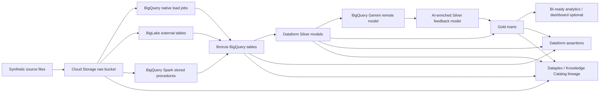

# Airport Operations Lakehouse Demo on Google Cloud

> **Status:** Planning blueprint for implementation.  
> **Audience:** OpenCode / implementation agents / Google Cloud data engineers.  
> **Goal:** Build a generic, public-safe airport operations lakehouse demo using Google Cloud services: Cloud Storage, BigQuery, BigLake, BigQuery Spark stored procedures, Dataform, Gemini remote models, Dataplex / Knowledge Catalog lineage, and Cloud Composer.

This repository is intentionally generic. It must not use real airport data, real passenger data, proprietary Changi Airport data, logos, route schedules, or operationally sensitive details. All sample data must be synthetic.

---

## 1. Business Storyline

Airport operators run complex, time-sensitive operations across flights, passengers, baggage, security, retail, maintenance, weather disruption, and customer experience. These domains usually live in separate systems and file formats.

The demo storyline:

> An airport operations team wants a governed, analytics-ready lakehouse that ingests mixed-format operational data, transforms it through bronze/silver/gold layers, enriches multilingual passenger feedback with Gemini, validates data quality, and exposes clear lineage from raw files to business-ready marts.

Executive questions the demo should answer:

- Which terminals and zones are congested right now?
- Which flights are delayed, and what downstream passenger/baggage/commercial impact do they create?
- Are baggage journeys meeting service-level expectations?
- What are passengers complaining about across languages, and which issues are urgent?
- Can operations, analytics, and governance teams trace every KPI back to raw source data?

---

## 2. Architecture Summary

Core architecture:

```text
Synthetic airport source files
  -> Cloud Storage raw landing zone
  -> BigQuery Spark stored procedures / BigLake / native BigQuery loads
  -> Dataform operations call ingestion procedures and setup SQL assets
  -> Bronze BigQuery tables
  -> Silver conformed models
  -> Gemini enrichment via BigQuery remote model
  -> Gold analytics marts
  -> Dataform assertions, docs, dependency graph
  -> Dataplex / Knowledge Catalog lineage and metadata
```

Cloud Composer is the end-to-end orchestrator for the demo. Composer runs setup/generation/upload tasks, triggers Dataform commands or Dataform workflow invocations, monitors status, and publishes run summaries. Dataform remains the BigQuery-side analytics-engineering layer: it owns SQL operations, procedure calls, dependency graph, bronze/silver/gold models, docs, and assertions.

### Mermaid architecture



---

## 3. GCP Services Used

- **Cloud Storage**: raw file landing zone for mixed file formats.
- **BigQuery**: central warehouse/lakehouse query engine and table storage.
- **BigLake**: governed external tables over Cloud Storage objects using access delegation.
- **BigQuery Spark stored procedures**: serverless Spark ETL callable through BigQuery SQL `CALL` statements.
- **Dataform**: SQLX-based analytics engineering, dependency graph, orchestration of SQL operations, assertions, documentation, and bronze/silver/gold modeling.
- **BigQuery ML remote model over Gemini**: multilingual translation, sentiment, topic, urgency classification for customer feedback.
- **Dataplex / Knowledge Catalog / Data Lineage**: lineage graphs, metadata, glossary/aspects where implemented.
- **Cloud Composer**: mandatory end-to-end orchestrator that invokes Dataform workflow stages, monitors execution, and publishes run summaries.
- **Terraform**: recommended for infrastructure, IAM, APIs, buckets, datasets, and connections.

---

## 4. Design Principles

1. **Generic and public-safe**: no real airport or passenger data.
2. **Composer-led orchestration**: Cloud Composer owns the end-to-end DAG and runs Dataform commands/workflow invocations; Dataform owns the SQL dependency graph and analytics engineering assets.
3. **Use Spark only where it makes sense**: nested/messy/compressed data uses Spark stored procedures; simple files use native BigQuery or BigLake.
4. **Medallion architecture**: raw GCS -> bronze -> silver -> gold.
5. **AI is part of the data product**: Gemini enrichment is modeled as a silver/gold transformation, not a detached side demo.
6. **Governance visible by default**: lineage, documentation, assertions, IAM, and cost controls are part of the MVP.
7. **Implementation agent friendly**: this README is a build spec for OpenCode. Avoid ambiguous “figure it out” gaps.

---

## 5. Source Data Contracts

Create 10 synthetic source datasets. All generated data must be deterministic using a seed.

| # | Source | File format | Example path | Ingestion pattern |
|---|---|---|---|---|
| 1 | Flight schedules | CSV | `raw/flight_schedules/dt=YYYY-MM-DD/flight_schedules.csv` | Native BigQuery load from GCS |
| 2 | Flight events | Newline-delimited JSON | `raw/flight_events/dt=YYYY-MM-DD/flight_events.jsonl` | BigQuery Spark stored procedure |
| 3 | Passenger flow sensors | Gzip CSV | `raw/passenger_flow/dt=YYYY-MM-DD/passenger_flow.csv.gz` | BigQuery Spark stored procedure |
| 4 | Baggage events | Parquet | `raw/baggage_events/dt=YYYY-MM-DD/baggage_events.parquet` | BigLake or native BigQuery load |
| 5 | Gate allocations | CSV | `raw/gate_allocations/dt=YYYY-MM-DD/gate_allocations.csv` | External table / BigLake |
| 6 | Security wait times | Nested JSON | `raw/security_wait_times/dt=YYYY-MM-DD/security_wait_times.json` | BigQuery Spark stored procedure |
| 7 | Retail transactions | Parquet | `raw/retail_transactions/dt=YYYY-MM-DD/retail_transactions.parquet` | BigLake table |
| 8 | Weather observations | CSV | `raw/weather_observations/dt=YYYY-MM-DD/weather_observations.csv` | Native BigQuery load |
| 9 | Maintenance work orders | Nested JSON | `raw/maintenance_work_orders/dt=YYYY-MM-DD/work_orders.json` | BigQuery Spark stored procedure |
| 10 | Customer feedback multilingual | JSON | `raw/customer_feedback/dt=YYYY-MM-DD/customer_feedback.json` | BigQuery Spark stored procedure, then Gemini enrichment |

### Required synthetic anomalies

The data generator should intentionally create a few realistic anomalies for Dataform assertions:

- delayed flights
- overlapping gate allocation conflict
- late baggage scan
- high security wait time
- negative/invalid passenger count record
- missing flight reference in one baggage event
- multilingual passenger feedback: English, Bahasa Indonesia/Malay, Mandarin, Japanese, Korean, Tamil, Hindi, French
- malformed or ambiguous feedback text for Gemini fallback testing

---

## 6. Medallion Model

### 6.1 Bronze layer

Dataset: `airport_bronze`

Bronze tables preserve source-level records while standardizing ingestion metadata.

Tables:

1. `brz_flight_schedules`
2. `brz_flight_events`
3. `brz_passenger_flow`
4. `brz_baggage_events`
5. `brz_gate_allocations`
6. `brz_security_wait_times`
7. `brz_retail_transactions`
8. `brz_weather_observations`
9. `brz_maintenance_work_orders`
10. `brz_customer_feedback`

Required metadata columns on every bronze table:

- `_batch_id STRING`
- `_source_file STRING`
- `_source_format STRING`
- `_ingested_at TIMESTAMP`
- `_record_hash STRING`

### 6.2 Silver layer

Dataset: `airport_silver`

Silver models are conformed, cleaned, typed, deduplicated, and join-ready.

Models:

1. `slv_flights`
   - flight schedule + current operational status
   - one row per flight occurrence

2. `slv_flight_delays`
   - delay minutes, delay bucket, normalized delay cause

3. `slv_passenger_flow`
   - cleaned terminal/zone passenger flow observations

4. `slv_baggage_journey`
   - normalized baggage scan journey states

5. `slv_terminal_congestion`
   - passenger flow + security wait + gate utilization signals

6. `slv_commercial_activity`
   - retail transactions enriched by terminal, hour, flight bank

7. `slv_asset_reliability`
   - maintenance events normalized by asset, terminal, severity, status

8. `slv_customer_feedback_enriched`
   - multilingual feedback translated and classified with Gemini

### 6.3 Gold layer

Dataset: `airport_gold`

Gold marts are business-ready analytics products.

1. `gold_airport_operations_daily`
   - daily operational KPIs
   - total flights, delay rate, average delay, passenger volume, baggage SLA, average wait time

2. `gold_terminal_performance_hourly`
   - terminal/hour congestion, passenger movement, wait time, gate utilization

3. `gold_flight_disruption_impact`
   - delayed flights with downstream passenger, baggage, gate, and commercial impact

4. `gold_baggage_service_quality`
   - baggage journey SLA, missing scans, delayed bag risk

5. `gold_passenger_experience_insights`
   - Gemini-derived sentiment/topic/urgency, passenger experience trends, top complaint categories

---

## 7. Dataform Design

Dataform is the primary BigQuery-side analytics engineering layer. Cloud Composer is the end-to-end operational orchestrator that runs the Dataform stages.

It should manage:

- setup SQL operations
- creation/calling of BigQuery Spark stored procedures
- external table / BigLake SQL definitions where feasible
- source declarations
- bronze/silver/gold SQLX models
- Gemini enrichment SQL
- assertions
- table/column documentation
- tags for selective execution

### 7.1 Dataform tags

Use these tags consistently:

- `setup`
- `ingestion`
- `bronze`
- `silver`
- `gold`
- `quality`
- `ai`
- `daily`
- `hourly`
- `critical_ops`

### 7.2 Dataform execution sequence

```text
setup
  -> ingestion
  -> bronze
  -> silver
  -> ai
  -> gold
  -> quality
```

### 7.3 Dataform operations

Create operations under `dataform/definitions/operations/`.

Recommended operations:

1. `create_spark_connection.sqlx`
2. `create_biglake_connection.sqlx`
3. `create_gemini_remote_model.sqlx`
4. `create_external_tables.sqlx`
5. `create_spark_procedures.sqlx`
6. `load_flight_schedules.sqlx`
7. `load_weather_observations.sqlx`
8. `call_sp_flight_events.sqlx`
9. `call_sp_passenger_flow.sqlx`
10. `call_sp_security_wait_times.sqlx`
11. `call_sp_maintenance_work_orders.sqlx`
12. `call_sp_customer_feedback.sqlx`

Important implementation note:

- Terraform should own APIs, IAM, buckets, datasets, service accounts, and connections where SQL support is awkward or IAM-dependent.
- Dataform should own BigQuery SQL assets, stored procedures, procedure calls, transformations, assertions, and docs.

### 7.4 Example operation calling a Spark procedure

```sql
config {
  type: "operations",
  tags: ["ingestion", "bronze"],
  hasOutput: true
}

CALL `${dataform.projectConfig.defaultDatabase}.airport_ops_control.sp_load_passenger_flow`(
  "gs://airport-demo-${dataform.projectConfig.vars.env}/raw/passenger_flow/*.csv.gz",
  "${dataform.projectConfig.vars.batch_id}"
);
```

If a downstream SQLX model depends on an operation, configure the operation with `hasOutput: true` and add explicit dependencies as required by Dataform.

### 7.5 Includes

Create reusable includes:

```text
dataform/includes/constants.js
dataform/includes/metrics.js
dataform/includes/prompts.js
dataform/includes/quality.js
```

Examples:

- terminal constants
- SLA thresholds
- airport timezone
- delay bucket SQL
- congestion scoring SQL
- baggage SLA SQL
- Gemini prompt templates

---

## 8. BigQuery Spark Stored Procedure Design

Use BigQuery Spark stored procedures for sources where Spark adds value:

- compressed CSV parsing
- nested JSON flattening
- schema normalization
- data cleansing before bronze
- adding ingestion metadata
- hashing records

Stored procedures should be callable from Dataform operations using normal BigQuery `CALL` syntax.

### 8.1 Spark procedures

Create Python Spark scripts under:

```text
spark/procedures/
  load_flight_events.py
  load_passenger_flow.py
  load_security_wait_times.py
  load_maintenance_work_orders.py
  load_customer_feedback.py
```

Each procedure should:

1. accept source URI and batch ID parameters
2. read from Cloud Storage
3. normalize schema
4. add metadata columns
5. write to the target bronze BigQuery table
6. produce deterministic behavior for repeatable demos

### 8.2 Spark procedure caveats

Document clearly:

- BigQuery Spark stored procedures require a Spark connection.
- The stored procedure must be in the same location as the connection.
- Spark connection/service identities need Cloud Storage and BigQuery permissions.
- Spark procedures do not have a free tier and are billed as documented by BigQuery/Dataproc Serverless pricing.

---

## 9. Gemini / BigQuery Remote Model Design

Use BigQuery ML remote models over Gemini and call them from Dataform SQLX using `AI.GENERATE_TEXT`.

Primary use case:

> Translate multilingual passenger feedback to English, classify sentiment, identify topic, detect urgency, and produce a short summary.

### 9.1 Model setup operation

```sql
config {
  type: "operations",
  tags: ["setup", "ai"]
}

CREATE OR REPLACE MODEL `${dataform.projectConfig.defaultDatabase}.airport_ai.gemini_model`
REMOTE WITH CONNECTION `${dataform.projectConfig.defaultDatabase}.${dataform.projectConfig.vars.region}.airport_gemini_connection`
OPTIONS (
  ENDPOINT = 'gemini-2.5-flash'
);
```

Implementation agent must verify current model endpoint availability and region support against current Google Cloud docs.

### 9.2 AI enrichment SQLX concept

```sql
config {
  type: "table",
  tags: ["silver", "ai"],
  description: "Customer feedback translated to English and enriched with sentiment/topic/urgency using Gemini via BigQuery remote model."
}

WITH prompts AS (
  SELECT
    feedback_id,
    terminal_id,
    submitted_ts,
    feedback_text,
    source_language,
    CONCAT(
      'You are analyzing synthetic airport passenger feedback. ',
      'Return strict JSON with keys: detected_language, english_translation, sentiment, topic, urgency, summary. ',
      'sentiment must be one of positive, neutral, negative. ',
      'urgency must be one of low, medium, high. ',
      'Do not include markdown. Feedback: ',
      feedback_text
    ) AS prompt
  FROM ${ref("brz_customer_feedback")}
)

SELECT
  feedback_id,
  terminal_id,
  submitted_ts,
  feedback_text,
  source_language,
  result AS gemini_result_json
FROM AI.GENERATE_TEXT(
  MODEL `${dataform.projectConfig.defaultDatabase}.airport_ai.gemini_model`,
  TABLE prompts,
  STRUCT(
    0.2 AS temperature,
    512 AS max_output_tokens
  )
);
```

Implementation note: verify exact `AI.GENERATE_TEXT` output columns in current docs. If output differs, adapt the query and document the final schema.

### 9.3 AI safety and quality requirements

- Keep generated input synthetic.
- Use low temperature.
- Ask for strict JSON.
- Parse JSON in a downstream model.
- Add fallback fields for malformed JSON.
- Add assertions for allowed sentiment/urgency values.
- Do not place Gemini calls in every model; keep the expensive call scoped to feedback enrichment.

---

## 10. Assertions and Data Quality

Use Dataform built-in assertions and manual SQLX assertions.

### Built-in assertion examples

- `flight_id` non-null
- `feedback_id` unique
- `transaction_id` unique
- `passenger_count >= 0`
- `wait_minutes >= 0`
- `rating BETWEEN 1 AND 5`

### Manual assertion examples

Create under `dataform/definitions/assertions/`:

1. `assert_no_gate_double_booking.sqlx`
2. `assert_baggage_events_have_known_flights.sqlx`
3. `assert_gold_daily_kpis_non_negative.sqlx`
4. `assert_feedback_sentiment_allowed_values.sqlx`
5. `assert_no_missing_terminal_in_gold.sqlx`

Manual assertions must return zero rows when passing.

---

## 11. Lineage and Governance

### 11.1 Lineage target

The demo should show lineage like:

```text
GCS raw files
  -> BigQuery native/BigLake/Spark-ingested bronze tables
  -> Dataform silver models
  -> Gemini-enriched silver model
  -> gold marts
```

### 11.2 Dataplex / Knowledge Catalog

Use Dataplex / Knowledge Catalog for:

- lineage graph viewing
- metadata enrichment
- optional glossary terms
- optional aspects for synthetic PII / customer feedback classification

### 11.3 Caveat

Do not overclaim lineage. Procedure calls, Dataform API invocations, and custom operations might not automatically produce perfect lineage in every view. If needed, implement explicit custom lineage events in Composer or document the lineage boundaries.

### 11.4 Security extension: row-level security, column-level security, and masking

RLS/CLS should be included as a second-part governance extension, not forced into the MVP critical path.

Recommended Phase 2 governance demo:

- **Row-level security (RLS):** restrict terminal-level operational rows by role, for example Terminal 1 operations users only see `terminal_id = "T1"` rows in `gold_terminal_performance_hourly`.
- **Column-level security (CLS):** apply policy tags to sensitive synthetic fields such as synthetic customer contact fields, loyalty tier, free-text feedback, or operational notes.
- **Dynamic data masking:** mask synthetic contact-like fields or feedback excerpts for lower-privilege demo users.
- **Authorized views:** expose selected gold marts to BI users while preserving underlying RLS/CLS behavior.

Implementation caveat: BigQuery column-level access control uses policy tags and schema annotations. Google Cloud docs note that `CREATE TABLE` DDL cannot specify policy tags directly, so implementation may need Terraform, `bq` schema updates, or API-based schema updates rather than pure Dataform SQLX for policy-tag assignment.

Keep all security-demo data synthetic. Do not introduce real passenger PII.

### 11.5 Streaming extension: baggage events from Pub/Sub to BigQuery

Add a future real-time scenario where baggage scan events stop arriving as daily Parquet files and become live operational events.

Recommended extension design:

```text
Baggage scanner simulator
  -> Pub/Sub topic: baggage-events
  -> Pub/Sub BigQuery subscription
  -> airport_streaming.baggage_events_stream
  -> BigQuery continuous query / Dataform silver model
  -> near-real-time baggage SLA and disruption gold tables
```

Use a **Pub/Sub BigQuery subscription** for the first streaming version. Google Cloud docs state that BigQuery subscriptions write Pub/Sub messages directly to an existing BigQuery table using the BigQuery Storage Write API and don't require a separate subscriber client. This is simpler than Dataflow when messages don't require heavy transformation before landing.

Important implementation notes:

- BigQuery subscriptions provide **at-least-once** delivery, so downstream models must deduplicate by event ID / scan ID.
- Configure a dead-letter topic for schema or write failures.
- If exactly-once delivery or complex windowed transformations are required, add a Dataflow Pub/Sub-to-BigQuery template or custom Beam pipeline later.
- For CDC-style updates/deletes, Pub/Sub BigQuery subscriptions can support BigQuery CDC ingestion when schema settings and `_CHANGE_TYPE` / `_CHANGE_SEQUENCE_NUMBER` fields are used correctly.

### 11.6 Continuous query extension

Add an advanced real-time analytics extension using BigQuery continuous queries.

Candidate scenarios:

1. **Real-time baggage SLA table**
   - Source: `airport_streaming.baggage_events_stream`
   - Continuous query reads `APPENDS(TABLE ..., start_timestamp)`.
   - Output: `airport_realtime.baggage_sla_realtime`
   - Purpose: flag bags with missing load scans, late transfer scans, or routing anomalies.

2. **Operational alert Pub/Sub topic**
   - Continuous query filters severe baggage exceptions or terminal congestion events.
   - Output: `EXPORT DATA OPTIONS(format='CLOUD_PUBSUB', uri='...')`.
   - Purpose: trigger downstream alerting / application integration.

3. **Real-time Gemini enrichment**
   - Continuous query can call supported AI functions such as `AI.GENERATE_TEXT` over new rows and write enriched output to another BigQuery table or export to Pub/Sub.
   - Keep this optional because continuous AI calls can become expensive and harder to demo safely.

Implementation caveats:

- Continuous queries are long-running SQL jobs; document start/stop and cost controls.
- Use `APPENDS` for append-only streaming tables. Use `CHANGES` only where supported, especially for Pub/Sub export use cases.
- Stateful operations such as joins, aggregations, and windowing are documented but may be Pre-GA; verify current launch stage before making them part of the main demo.

### 11.7 Data insights automation extension

Add a second Composer DAG to generate Gemini-powered BigQuery data insights after bronze/silver/gold tables are built.

BigQuery data insights can generate:

- table descriptions
- column descriptions
- natural-language questions and SQL query recommendations
- dataset relationship graphs and cross-table query recommendations

Recommended DAG: `airport_ops_generate_data_insights`

```text
wait_for_lakehouse_run_complete
  -> trigger_table_documentation_scans_for_gold_tables
  -> trigger_dataset_insights_for_airport_gold
  -> poll_dataplex_datascan_jobs
  -> publish_metadata_to_knowledge_catalog_where_enabled
  -> publish_insights_summary
```

Implementation path from docs:

- Enable Dataplex API, BigQuery API, and Gemini for Google Cloud API.
- Set up Gemini in BigQuery.
- Prefer running Dataplex `DATA_DOCUMENTATION` scans through the Dataplex API.
- For table insights, create/run a `dataScans` resource with `type: "DATA_DOCUMENTATION"` and `dataDocumentationSpec.generationScopes` set to `ALL`, `TABLE_AND_COLUMN_DESCRIPTIONS`, or `SQL_QUERIES`.
- Use `catalogPublishingEnabled: true` when the demo should publish generated descriptions to Knowledge Catalog.
- Poll scan status with `dataScans.get` / scan job status until `SUCCEEDED` or `FAILURE`.
- For one-off demo runs, use one-time scans with TTL after scan completion so scan resources clean themselves up.

Important caveats:

- Dataset insights are Preview in the docs; keep dataset-level relationship graph generation as an extension, not an MVP acceptance criterion.
- Data insights are Gemini in BigQuery features and have pricing/compliance caveats distinct from core BigQuery.
- For BigLake or external tables, required service accounts need Cloud Storage object read permissions for the underlying bucket.

---

## 12. Cloud Composer Orchestration

Composer is mandatory for the end-to-end demo. It is the operational orchestrator that runs the pipeline and invokes Dataform.

Composer DAG responsibilities:

1. generate or resolve `batch_id`
2. optionally generate synthetic data for demo mode
3. upload raw files to Cloud Storage
4. run Terraform/bootstrap checks only if explicitly wired for demo automation
5. invoke Dataform commands or Dataform workflow invocations for tags/stages
6. monitor Dataform execution status
7. run post-run BigQuery validation queries
8. expose Composer/OpenLineage lineage events where supported
9. publish a run summary

Recommended DAG stages:

```text
validate_environment
  -> generate_demo_data
  -> upload_raw_files_to_gcs
  -> run_dataform_setup
  -> run_dataform_ingestion
  -> run_dataform_silver
  -> run_dataform_ai
  -> run_dataform_gold
  -> run_dataform_quality
  -> post_run_validation
  -> publish_run_summary
```

Implementation options:

- **Preferred MVP:** Composer runs a repository script such as `scripts/run_dataform.sh --tags ingestion` from the Composer environment or a Cloud Build/Cloud Run helper.
- **More cloud-native:** Composer calls the Dataform API to create compilation results and workflow invocations, then polls invocation status.

Dataform still owns SQL orchestration inside BigQuery: operations, procedure calls, dependencies, models, assertions, and documentation. Composer owns the outer DAG and scheduling.

---

## 13. IAM and Service Accounts

Implementation must define least-privilege IAM in Terraform where possible.

Required identities:

- Dataform execution service account
- BigQuery Spark connection service identity
- BigLake connection service account
- Gemini/BigQuery remote model connection service account
- Optional Composer worker service account

Required permissions will include, but are not limited to:

- BigQuery dataset/table/model create and query permissions
- BigQuery connection admin/user/delegate permissions
- Cloud Storage object read permissions for raw bucket
- permissions to grant Vertex AI / Gemini endpoint access to the BigQuery connection service account
- Dataproc / Spark permissions for serverless Spark execution
- optional Dataplex / Data Lineage permissions

Implementation agent must verify exact roles from current Google Cloud docs before applying Terraform.

---

## 14. Cost Controls

This demo must be cheap and teardown-friendly.

Requirements:

- Use small synthetic data volumes.
- Partition large/fact tables by date/hour.
- Cluster by common filters such as `terminal_id`, `flight_id`, `airline_code`.
- Avoid unnecessary Gemini calls; only run on a small feedback table.
- Avoid repeated Spark runs without need.
- Add `scripts/teardown.sh` or Terraform destroy instructions.
- Document that Spark procedures and Gemini remote model inference incur cost.
- Prefer a single region for bucket, datasets, connections, Dataform, and Spark resources.

---

## 15. Recommended Repository Structure

```text
airport-ops-lakehouse-demo/
  README.md
  docs/
    architecture.md
    gcp-docs.md
    demo-script.md
    iam.md
    lineage.md
    cost-controls.md
  infra/
    terraform/
      main.tf
      variables.tf
      outputs.tf
      apis.tf
      iam.tf
      bigquery.tf
      storage.tf
  dataform/
    workflow_settings.yaml
    package.json
    definitions/
      operations/
      sources/
      bronze/
      silver/
      gold/
      assertions/
    includes/
      constants.js
      metrics.js
      prompts.js
      quality.js
  spark/
    procedures/
      load_flight_events.py
      load_passenger_flow.py
      load_security_wait_times.py
      load_maintenance_work_orders.py
      load_customer_feedback.py
  scripts/
    generate_demo_data.py
    upload_demo_data.sh
    run_dataform.sh
    teardown.sh
  sample_data/
    README.md
```

---

## 16. Implementation Phases

### Phase 0 — Planning repo

- Create README and docs with architecture, docs links, and build spec.
- No cloud resources yet.

### Phase 1 — Synthetic data + Dataform skeleton

- Implement deterministic data generator.
- Generate all 10 source files locally.
- Create Dataform project skeleton.
- Add source declarations, placeholder operations, and model stubs.
- Ensure `dataform compile` passes.

### Phase 2 — Infrastructure

- Terraform for APIs, GCS bucket, BigQuery datasets, service accounts, IAM, connections.
- Add setup docs.
- Verify `terraform validate`.

### Phase 3 — Ingestion

- Implement native BigQuery loads.
- Implement BigLake/external tables.
- Implement Spark stored procedures.
- Implement Dataform operations that call ingestion procedures.

### Phase 4 — Silver/gold transformations

- Implement all bronze/silver/gold SQLX models.
- Add partitioning/clustering.
- Add documentation and labels.

### Phase 5 — Gemini enrichment

- Create BigQuery remote model.
- Implement feedback enrichment.
- Parse and validate Gemini output.
- Add cost/safety guardrails.

### Phase 6 — Quality and lineage

- Add assertions.
- Verify lineage visibility.
- Add optional Dataplex glossary/aspect metadata.

### Phase 7 — Composer orchestration

- Add Composer DAG as the required end-to-end orchestrator.
- DAG generates/uploads raw demo data, invokes Dataform by stage/tag, monitors status, runs validation, and publishes summary.
- Keep Dataform responsible for SQL operations/procedure calls/models/assertions; keep Composer responsible for scheduling and outer workflow control.

---

## 17. Acceptance Criteria

The implementation is complete when:

- [ ] Synthetic data generator creates 10 source datasets.
- [ ] Files upload to Cloud Storage raw paths.
- [ ] Terraform creates required GCP resources.
- [ ] BigQuery native loads work for simple CSV/Parquet sources.
- [ ] BigLake/external tables work for selected GCS-backed datasets.
- [ ] BigQuery Spark stored procedures load messy/compressed/nested sources into bronze.
- [ ] Dataform operations call stored procedures successfully.
- [ ] Dataform compiles cleanly.
- [ ] Dataform run creates bronze, silver, and gold models.
- [ ] Gemini remote model enriches multilingual feedback.
- [ ] Assertions run and fail/pass as expected on controlled synthetic anomalies.
- [ ] Gold marts answer the business questions.
- [ ] Lineage can be viewed or documented clearly.
- [ ] Composer DAG orchestrates the end-to-end run and invokes Dataform by stage/tag or workflow invocation.
- [ ] Phase 2 governance backlog documents RLS, CLS/policy tags, dynamic masking, and authorized views.
- [ ] Extension backlog documents streaming baggage events via Pub/Sub BigQuery subscriptions.
- [ ] Extension backlog documents BigQuery continuous query scenarios for real-time baggage SLA and operational alerting.
- [ ] Extension backlog documents a second Composer DAG for BigQuery data insights / Dataplex data documentation scans.
- [ ] README includes setup, run, validation, teardown, and troubleshooting instructions.
- [ ] No real PII, secrets, credentials, or proprietary airport data are committed.

---

## 18. Demo Script

A 15–20 minute demo should follow this sequence:

1. Explain airport operations problem.
2. Show mixed-format synthetic source files in Cloud Storage.
3. Show Composer DAG and explain it is the end-to-end orchestrator.
4. Show Dataform graph with setup/ingestion/bronze/silver/gold/quality tags.
5. Run Composer DAG; Composer invokes Dataform ingestion operations that call BigQuery Spark procedures.
6. Show bronze tables populated with metadata columns.
7. Show silver conformed models and Dataform `ref()` dependency graph.
8. Show Gemini enrichment of multilingual customer feedback.
9. Show gold marts answering operational questions.
10. Show assertions/data quality results.
11. Show lineage from raw/bronze to gold where available.
12. Close with governance, cost, and extensibility story.

---

## 19. Official GCP Documentation References

See [`docs/gcp-docs.md`](docs/gcp-docs.md) for the full official documentation map used to ground this plan.

Key references:

- Dataform SQL workflows: https://docs.cloud.google.com/dataform/docs/sql-workflows
- Dataform dependencies: https://docs.cloud.google.com/dataform/docs/dependencies
- Dataform custom SQL operations: https://docs.cloud.google.com/dataform/docs/custom-sql
- Dataform assertions: https://docs.cloud.google.com/dataform/docs/assertions
- Dataform create tables / incremental tables: https://docs.cloud.google.com/dataform/docs/create-tables
- BigQuery CSV loading from GCS: https://docs.cloud.google.com/bigquery/docs/loading-data-cloud-storage-csv
- BigQuery Parquet loading from GCS: https://docs.cloud.google.com/bigquery/docs/loading-data-cloud-storage-parquet
- BigQuery external tables on GCS: https://docs.cloud.google.com/bigquery/docs/external-data-cloud-storage
- BigLake overview: https://docs.cloud.google.com/bigquery/docs/biglake-intro
- Create Cloud Storage BigLake tables: https://docs.cloud.google.com/bigquery/docs/create-cloud-storage-table-biglake
- BigQuery Spark stored procedures: https://docs.cloud.google.com/bigquery/docs/spark-procedures
- BigQuery connect to Spark: https://docs.cloud.google.com/bigquery/docs/connect-to-spark
- BigQuery AI.GENERATE_TEXT: https://docs.cloud.google.com/bigquery/docs/generate-text
- ML.GENERATE_TEXT reference: https://docs.cloud.google.com/bigquery/docs/reference/standard-sql/bigqueryml-syntax-generate-text
- Create remote model syntax: https://docs.cloud.google.com/bigquery/docs/reference/standard-sql/bigqueryml-syntax-create-remote-model
- Gemini sentiment tutorial: https://docs.cloud.google.com/bigquery/docs/generate-text-tutorial-gemini
- Composer lineage integration: https://docs.cloud.google.com/composer/docs/composer-3/lineage-integration
- Dataplex / Knowledge Catalog overview: https://docs.cloud.google.com/dataplex/docs/catalog-overview
- Google Cloud medallion architecture overview: https://cloud.google.com/discover/what-is-medallion-architecture
- Google Cloud Lakehouse key concepts: https://docs.cloud.google.com/lakehouse/docs/key-concepts
- BigQuery row-level security intro: https://docs.cloud.google.com/bigquery/docs/row-level-security-intro
- BigQuery column-level access control intro: https://docs.cloud.google.com/bigquery/docs/column-level-security-intro
- BigQuery column-level access control guide: https://docs.cloud.google.com/bigquery/docs/column-level-security
- BigQuery authorized views: https://docs.cloud.google.com/bigquery/docs/authorized-views
- Pub/Sub BigQuery subscriptions: https://docs.cloud.google.com/pubsub/docs/bigquery
- Dataflow Pub/Sub to BigQuery streaming tutorial: https://docs.cloud.google.com/dataflow/docs/tutorials/dataflow-stream-to-bigquery
- BigQuery continuous queries introduction: https://docs.cloud.google.com/bigquery/docs/continuous-queries-introduction
- BigQuery continuous queries guide/examples: https://docs.cloud.google.com/bigquery/docs/continuous-queries
- BigQuery data insights overview: https://docs.cloud.google.com/bigquery/docs/data-insights
- Generate table insights: https://docs.cloud.google.com/bigquery/docs/generate-table-insights
- Generate dataset insights: https://docs.cloud.google.com/bigquery/docs/generate-dataset-insights

---

## 20. Notes for OpenCode

When implementing from this README:

1. Start by creating the repo structure exactly as specified.
2. Add implementation incrementally; keep `dataform compile` passing after every Dataform phase.
3. Use Terraform for IAM, APIs, buckets, datasets, and connections.
4. Use Dataform operations for SQL assets and procedure calls.
5. Verify every GCP command against current docs before hardcoding syntax.
6. Keep all data synthetic.
7. Never commit credentials, `.env`, service account keys, or real project secrets.
8. Add `.env.example` and `terraform.tfvars.example`, not real values.
9. Include teardown instructions before adding resource-creating scripts.
10. Prefer clear, boring, verifiable code over clever abstractions.
