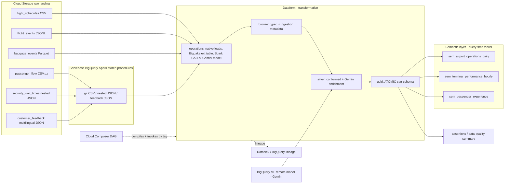

# Architecture & infrastructure

This is the technical reference for the demo: the tech stack, how the pieces are
wired on Google Cloud, and the infrastructure behind it. For the *reasoning*
behind the data model (medallion, star schema vs semantic layer), see
[`design-philosophy.md`](design-philosophy.md).

## Tech stack

| Service | Role in the demo |
|---|---|
| **Cloud Storage** | Raw landing zone for the six source files, partitioned `dt=YYYY-MM-DD`. |
| **BigQuery** | The lakehouse engine — storage + compute for every layer. |
| **BigLake** | A governed external table over the Parquet baggage files. |
| **BigQuery Spark stored procedures** | Serverless PySpark, called via SQL `CALL`, for gzip CSV, nested JSON, and multilingual JSON. |
| **Dataform** | The transformation layer: SQL dependency graph, bronze/silver/gold, assertions, docs, lineage. |
| **BigQuery ML remote model (Gemini)** | `AI.GENERATE_TEXT` translation + classification of feedback. |
| **Cloud Composer (Airflow)** | The outer orchestrator; drives Dataform via the native operators. |
| **Dataplex / BigQuery lineage** | Lineage and metadata from raw to gold. |
| **Secret Manager** | Holds the Git token the GCP Dataform repository uses to read the companion repo. |

## End-to-end flow



## The six sources and their ingestion patterns

The point of six sources is to show *the right ingestion tool per format*.

| # | Source | Format | Ingestion pattern | Dataform action |
|---|---|---|---|---|
| 1 | flight_schedules | CSV | Native BigQuery load | `op_load_flight_schedules` |
| 2 | flight_events | NDJSON | Native BigQuery load | `op_load_flight_events` |
| 3 | baggage_events | Parquet | **BigLake external table** | `op_create_biglake_baggage` |
| 4 | passenger_flow | gzip CSV | **Spark stored procedure** | `op_call_sp_passenger_flow` |
| 5 | security_wait_times | nested JSON | **Spark stored procedure** | `op_call_sp_security_wait` |
| 6 | customer_feedback | multilingual JSON | **Spark proc → Gemini** | `op_call_sp_customer_feedback` |

The deterministic generator (`scripts/generate_demo_data.py`, fixed seed) also
plants realistic anomalies — a gate double-booking, an orphan baggage event, a
negative passenger count, a high security wait, missing baggage scans — so the
assertions and the data-quality summary have something to catch.

## Layer responsibilities

| Layer | Tech | Owns |
|---|---|---|
| Orchestration | Cloud Composer | Outer DAG, stage sequencing, run summary |
| Transformation | Dataform | SQL graph, bronze/silver/gold, assertions, docs, lineage |
| Heavy ingestion | BigQuery Spark stored procedures | gzip CSV, nested JSON, multilingual JSON |
| AI enrichment | BigQuery ML remote model (Gemini) | translate + classify feedback |
| Storage/compute | BigQuery + BigLake + Cloud Storage | tables, external tables, raw files |
| Semantic layer | BigQuery views (→ Looker/AtScale/Cube) | query-time roll-up, metric definitions |
| Governance | Dataplex / lineage + assertions | lineage, data quality |

## Datasets (region `us-central1`)

| Dataset | Contents |
|---|---|
| `airport_ops_control` | raw landing tables + the Spark stored procedures |
| `airport_bronze` | typed bronze tables with ingestion metadata |
| `airport_silver` | conformed silver models + Gemini-enriched feedback |
| `airport_gold` | atomic star schema (dims + facts) + data-quality summary |
| `airport_semantic` | semantic roll-up views |
| `airport_ai` | Gemini remote model |
| `dataform_assertions` | assertion results |

Everything is **regional `us-central1`** and must stay co-located with the Spark
connection — a Spark stored procedure must be in the same location as its
connection.

## The data model

**Gold = atomic star schema** (`airport_gold`):

- Dimensions: `dim_terminal`, `dim_airline`, `dim_date`
- Facts: `fct_flight` (one row per flight), `fct_baggage` (one row per bag,
  orphans quarantined via inner join), `fct_feedback` (one row per feedback, with
  Gemini attributes)
- `gold_data_quality_summary` — counts of caught/quarantined anomalies

**Semantic layer = views** (`airport_semantic`), each a `GROUP BY` over the
atomic facts: `sem_airport_operations_daily`, `sem_terminal_performance_hourly`,
`sem_passenger_experience`. Why this split exists is the subject of
[`design-philosophy.md`](design-philosophy.md).

Per Google Cloud guidance, **BigQuery is the recommended engine for serving the
gold layer** (query performance + concurrency), with Dataform building the SQL
transformations from silver to gold — which is exactly this design.

## Two-repo design

A **GCP Dataform repository** (the cloud resource Composer invokes) reads its
project from the **root** of a Git repository. So the Dataform project lives in
its own repo:

- `airport-ops-lakehouse-demo` — this repo: generator, scripts, Composer DAG, docs.
- `airport-ops-lakehouse-dataform` — the Dataform project at repo root
  (`workflow_settings.yaml` + `definitions/` + `includes/`).

Wiring:

```
GitHub: airport-ops-lakehouse-dataform (main)
   │  read via Git token
   ▼
Secret Manager: dataform-git-token   ──grant──▶ Dataform service agent
   │
   ▼
GCP Dataform repository: airport-ops-lakehouse-dataform (us-central1)
   │  compiled + invoked
   ▼
Cloud Composer DAG: airport_ops_lakehouse
```

The Dataform service agent
(`service-<PROJECT_NUMBER>@gcp-sa-dataform.iam.gserviceaccount.com`) is granted
`secretmanager.secretAccessor` on `dataform-git-token`. The GCP Dataform
repository is configured with the GitHub remote URL, branch `main`, and that
secret.

## BigQuery connections (reused, not created by this demo)

The demo reuses three existing connections; `bootstrap.sh` grants them IAM but
does not create them. Each connection has its own Google-managed service
identity.

| Connection | Type | Used for | Identity needs |
|---|---|---|---|
| `spark-etl-conn` | SPARK | Spark stored procedures | BigQuery data/job, GCS read, Dataproc worker |
| `gemini_conn` | CLOUD_RESOURCE | Gemini remote model | `roles/aiplatform.user` |
| `default-us-central1` | CLOUD_RESOURCE | BigLake external table | GCS read on the raw bucket |

## IAM (granted by `bootstrap.sh`)

- **Dataform execution SA** (`dataform-airport@…`): `bigquery.dataEditor`,
  `bigquery.jobUser`, `bigquery.connectionUser`, `storage.objectViewer`,
  `dataproc.editor`.
- **Gemini connection SA**: `aiplatform.user`.
- **Spark connection SA**: `bigquery.dataEditor`, `bigquery.jobUser`,
  `storage.objectViewer`, `dataproc.worker`.
- **Composer worker SA**: `dataform.admin` on the project + `serviceAccountUser`
  on the Dataform execution SA (so it can run workflow invocations).

## The Composer DAG

`composer/dags/airport_ops_lakehouse_dag.py` uses the native Airflow Dataform
operators:

- `DataformCreateCompilationResultOperator` — compiles the connected Git repo
  **once**, at `git_commitish = main`, stamping every bronze row with the Airflow
  run id via a compilation var (`batchId = {{ run_id }}`).
- `DataformCreateWorkflowInvocationOperator` — one invocation **per stage**,
  filtered by tag, with `transitive_dependencies_included = False` and
  `asynchronous=False`, so each task waits for its Dataform invocation to
  finish. No separate workflow-invocation sensor is needed.

Stages, in order — one Dataform tag each:

```
compile_repo
  → setup       (Spark procs, BigLake ext table, Gemini model)
  → ingestion   (native loads + Spark CALLs into raw tables)
  → bronze      (typed bronze + ingestion metadata)
  → silver      (conformed + Gemini enrichment)
  → gold        (atomic star schema)
  → semantic    (roll-up views)
  → quality     (assertions + data-quality summary)
  → publish_run_summary   (BigQuery query over sem_airport_operations_daily)
```

Because transitive dependencies are disabled, **each medallion layer is its own
stage with its own tag** — including `bronze`. (An earlier version omitted the
`bronze` stage, which meant bronze tables were never built; the layers are now
explicit, which also makes the medallion flow visible in the Airflow graph.)

The DAG orchestrates Dataform only. Raw data is seeded beforehand by
`scripts/upload_demo_data.sh`; in production this would be a managed ingestion
task.

## Spark stored procedures

Defined inline in the Dataform operation
`definitions/operations/op_create_spark_procedures.sqlx` using PySpark embedded in
BigQuery DDL:

```sql
CREATE OR REPLACE PROCEDURE `…airport_ops_control.sp_load_passenger_flow`(...)
WITH CONNECTION `us-central1.spark-etl-conn`
OPTIONS(engine="SPARK", runtime_version="2.2")
LANGUAGE PYTHON AS R"""
# PySpark: read from GCS, normalise, add ingestion metadata, write to BigQuery
"""
```

Parameters are read inside the procedure from `BIGQUERY_PROC_PARAM.*`. The three
procedures handle passenger_flow (gzip CSV), security_wait_times (nested JSON),
and customer_feedback (multilingual JSON). They are created in the `setup` stage
and `CALL`ed in the `ingestion` stage.

## Gemini enrichment

- The remote model `airport_ai.gemini_model` is created over `gemini_conn`
  pointing at the `gemini-2.5-flash` endpoint
  (`op_create_gemini_model`, `setup` stage).
- `slv_customer_feedback_enriched` builds a prompt per feedback row
  (`includes/prompts.js`, with allowed sentiment/urgency values pulled from
  `includes/constants.js`) and calls `AI.GENERATE_TEXT(MODEL …, TABLE prompts,
  STRUCT(0.2 AS temperature, 512 AS max_output_tokens))`.
- The model is asked for strict minified JSON; the output column `result` is
  parsed with `SAFE.PARSE_JSON` plus a regex code-fence strip and `CASE`
  fallbacks, so malformed responses degrade gracefully.
- `assert_feedback_sentiment_allowed` then gates the parsed `sentiment` against
  the same allowed-values constant.

## Lineage & governance

- Dataform's `ref()` graph is the lineage and the documentation.
- BigQuery / Dataplex lineage shows raw → bronze → silver → gold.
- Assertions in the `quality` stage are real gates; anomalies are quarantined in
  silver so the pipeline stays green while `gold_data_quality_summary` surfaces
  what was caught.
- A caveat: Spark `CALL`s and remote-model calls may not produce perfect
  automatic lineage for every hop; document boundaries where needed.

See [`roadmap.md`](roadmap.md) for governance extensions (RLS/CLS, masking),
streaming, continuous queries, and automated data insights.
