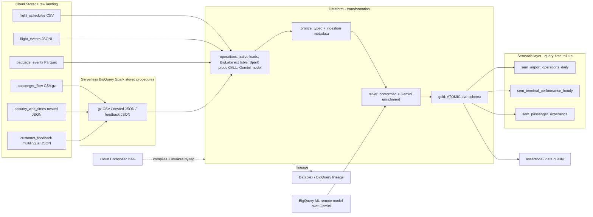

# Architecture



## Layer responsibilities

| Layer | Tech | Owns |
|---|---|---|
| Orchestration | Cloud Composer (Airflow) | Outer DAG, scheduling, stage sequencing, run summary |
| Transformation | Dataform | SQL graph, bronze/silver/gold, assertions, docs, lineage |
| Heavy ingestion | BigQuery Spark stored procedures | gzip CSV, nested JSON, multilingual JSON |
| AI enrichment | BigQuery ML remote model (Gemini) | translate + classify feedback |
| Storage/compute | BigQuery + BigLake + Cloud Storage | tables, external tables, raw files |
| Semantic layer | BigQuery views (→ Looker/AtScale/Cube) | query-time roll-up, metric definitions |
| Governance | Dataplex / BigQuery lineage, assertions | lineage, quality, (Phase 2: RLS/CLS) |

## Datasets (region us-central1)

| Dataset | Contents |
|---|---|
| `airport_ops_control` | raw landing tables (loaded by ops/Spark) + Spark procedures |
| `airport_bronze` | typed bronze tables with ingestion metadata |
| `airport_silver` | conformed silver models + Gemini-enriched feedback |
| `airport_gold` | atomic star schema (dims + facts) + data quality summary |
| `airport_semantic` | semantic roll-up views |
| `airport_ai` | Gemini remote model |
| `dataform_assertions` | assertion results |

## Two-repo layout

- `airport-ops-lakehouse-demo` (this repo): docs, data generator, Spark reference
  code, Composer DAG, scripts, infra.
- `airport-ops-lakehouse-dataform`: the Dataform project at repo root, connected
  to the GCP Dataform repository and invoked by Composer.

See [`semantic-layer.md`](semantic-layer.md) and
[`why-dataform-not-python.md`](why-dataform-not-python.md) for the design
rationale, and [`demo-script.md`](demo-script.md) for the runbook.
```
