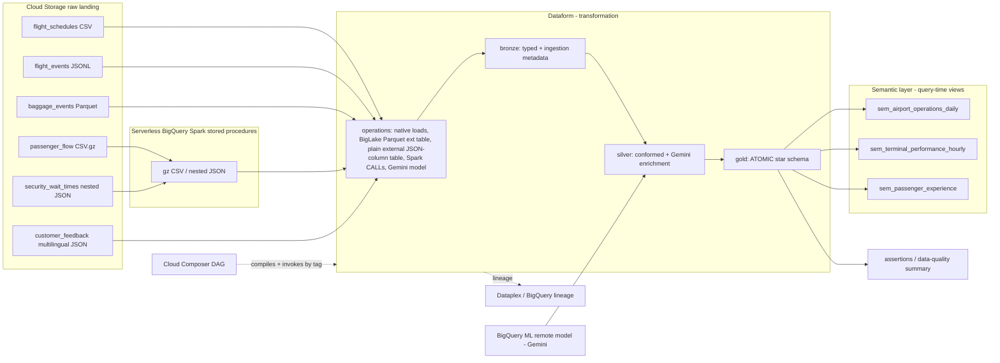

# Architecture & infrastructure

This is the technical reference for the demo: the tech stack, how the pieces are
wired on Google Cloud, and the infrastructure behind it. For the *reasoning*
behind the data model (medallion, star schema vs semantic layer), see
[`design-philosophy.md`](design-philosophy.md).

## Tech stack

| Service | Role in the demo |
|---|---|
| **Cloud Storage** | Raw landing zone for the six source files, partitioned `dt=YYYY-MM-DD`. |
| **BigQuery** | The lakehouse engine — storage + compute for every layer. |
| **BigLake** | A governed external table over the columnar Parquet baggage files. |
| **External table (plain) + BigQuery `JSON` type** | Customer-feedback NDJSON mapped to a single native `JSON` column; bronze reads it as a non-materialised view (deliberate anti-pattern). |
| **BigQuery Spark stored procedures** | Serverless PySpark, called via SQL `CALL`, for gzip CSV and nested JSON. |
| **Dataform** | The transformation layer: SQL dependency graph, bronze/silver/gold, assertions, docs, lineage. |
| **BigQuery ML remote model (Gemini)** | `AI.GENERATE_TEXT` translation + classification of feedback. |
| **Cloud Composer (Airflow)** | The outer orchestrator; drives Dataform via the native operators. |
| **Dataplex / BigQuery lineage** | Lineage and metadata from raw to gold. |
| **Secret Manager** | Holds the Git token the GCP Dataform repository uses to read the companion repo. |

## End-to-end flow



## The six sources and their ingestion patterns

The point of six sources is to show *the right ingestion tool per format*.

| # | Source | Format | Ingestion pattern | Dataform action |
|---|---|---|---|---|
| 1 | flight_schedules | CSV | Native BigQuery load | `op_load_flight_schedules` |
| 2 | flight_events | NDJSON | Native BigQuery load | `op_load_flight_events` |
| 3 | baggage_events | Parquet | **BigLake external table** | `op_create_biglake_baggage` |
| 4 | passenger_flow | gzip CSV | **Spark stored procedure** | `op_call_sp_passenger_flow` |
| 5 | security_wait_times | nested JSON | **Spark stored procedure** | `op_call_sp_security_wait` |
| 6 | customer_feedback | NDJSON | **Plain external table → native `JSON` column** (bronze = view; anti-pattern) | `op_create_ext_customer_feedback` |

Note: sources 1–2 use native loads, source 3 a BigLake external table over
**columnar** Parquet, sources 4–5 serverless Spark, and source 6 a **plain**
external table over **row-oriented** NDJSON exposing a single native `JSON`
column. Gemini enrichment of feedback happens later, in silver
(`slv_customer_feedback_enriched`), independent of how bronze is loaded.

The deterministic generator (`scripts/generate_demo_data.py`, fixed seed) also
plants realistic anomalies — a gate double-booking, an orphan baggage event, a
negative passenger count, a high security wait, missing baggage scans — so the
assertions and the data-quality summary have something to catch.

## Layer responsibilities

| Layer | Tech | Owns |
|---|---|---|
| Orchestration | Cloud Composer | Outer DAG, stage sequencing, run summary |
| Transformation | Dataform | SQL graph, bronze/silver/gold, assertions, docs, lineage |
| Heavy ingestion | BigQuery Spark stored procedures | gzip CSV, nested JSON |
| External tables | BigLake (Parquet) + plain external (`JSON` column) | columnar baggage; row-oriented feedback JSON |
| AI enrichment | BigQuery ML remote model (Gemini) | translate + classify feedback |
| Storage/compute | BigQuery + BigLake + Cloud Storage | tables, external tables, raw files |
| Semantic layer | BigQuery views (→ Looker/AtScale/Cube) | query-time roll-up, metric definitions |
| Governance | Dataplex / lineage + assertions | lineage, data quality |

## Datasets (region `us-central1`)

| Dataset | Contents |
|---|---|
| `airport_ops_control` | raw landing tables + the Spark stored procedures |
| `airport_bronze` | typed bronze tables with ingestion metadata |
| `airport_silver` | conformed silver models + Gemini-enriched feedback |
| `airport_gold` | atomic star schema (dims + facts) + data-quality summary |
| `airport_semantic` | semantic roll-up views |
| `airport_ai` | Gemini remote model |
| `airport_governance` | RLS/CLS showcase (`staff_directory` + row/data policies) |
| `airport_share` | curated `shr_*` authorized views published via Analytics Hub (hub-and-spoke data sharing) |
| `dataform_assertions` | assertion results |

Everything is **regional `us-central1`** and must stay co-located with the Spark
connection — a Spark stored procedure must be in the same location as its
connection.

## The data model

**Gold = atomic star schema** (`airport_gold`):

- Dimensions: `dim_terminal`, `dim_airline`, `dim_date`
- Facts: `fct_flight` (one row per flight), `fct_baggage` (one row per bag,
  orphans quarantined via inner join), `fct_feedback` (one row per feedback, with
  Gemini attributes)
- `gold_data_quality_summary` — counts of caught/quarantined anomalies

**Semantic layer = views** (`airport_semantic`), each a `GROUP BY` over the
atomic facts: `sem_airport_operations_daily`, `sem_terminal_performance_hourly`,
`sem_passenger_experience`. Why this split exists is the subject of
[`design-philosophy.md`](design-philosophy.md).

Per Google Cloud guidance, **BigQuery is the recommended engine for serving the
gold layer** (query performance + concurrency), with Dataform building the SQL
transformations from silver to gold — which is exactly this design.

## Two-repo design

A **GCP Dataform repository** (the cloud resource Composer invokes) reads its
project from the **root** of a Git repository. So the Dataform project lives in
its own repo:

- `airport-ops-lakehouse-demo` — this repo: generator, scripts, Composer DAG, docs.
- `airport-ops-lakehouse-dataform` — the Dataform project at repo root
  (`workflow_settings.yaml` + `definitions/` + `includes/`).

Wiring:

```
GitHub: airport-ops-lakehouse-dataform (main)
   │  read via Git token
   ▼
Secret Manager: dataform-git-token   ──grant──▶ Dataform service agent
   │
   ▼
GCP Dataform repository: airport-ops-lakehouse-dataform (us-central1)
   │  compiled + invoked
   ▼
Cloud Composer DAG: airport_ops_lakehouse
```

The Dataform service agent
(`service-<PROJECT_NUMBER>@gcp-sa-dataform.iam.gserviceaccount.com`) is granted
`secretmanager.secretAccessor` on `dataform-git-token`. The GCP Dataform
repository is configured with the GitHub remote URL, branch `main`, and that
secret.

Public setup keeps this repository creation manual because Git provider choices
vary by user and organization. Google Cloud's Dataform flow is:

- Create a Dataform repository in the selected region with a custom execution
  service account.
- Connect the repository to Git through Developer Connect or through a Secret
  Manager secret containing a Git token.
- Grant the Dataform service agent access to the Git secret when using the
  Secret Manager path.

`bootstrap.sh` validates that the GCP Dataform repository exists, grants the
runtime IAM needed by the execution service account, writes Composer Airflow
Variables from `.env`, and uploads the DAGs. It does not create or connect the
GCP Dataform repository.

### A third path: UI-created pipelines (BigQuery Pipelines / Data Prep)

The two repos above are the **engineer door** (code + Composer). There is a
**third** way Dataform shows up that teams trip over: **BigQuery Data Pipelines**
and **Data Preparation** in BigQuery Studio (the *analyst door* — see
[`design-philosophy.md` → Part 3](design-philosophy.md#part-3--two-doors-to-one-engine-engineer-authored-vs-analyst-authored)).
Concrete mechanics matter here:

- **It is a *separate* Dataform repository.** Clicking "create pipeline" /
  "create data preparation" provisions a **new Dataform repo** with its own
  compilation/release config, **its own workflow configuration (Dataform-native
  cron) — NOT this demo's Composer DAG**, and its own service account.
- **Scope is per-pipeline-asset**, not per-user or per-project. Nothing forces it
  into a shared repo, so it sprawls fast if ungoverned (one repo per pipeline per
  analyst is possible).
- **Cross-repo dependency = `declaration` only.** `ref()` resolves *within one
  repo's* graph. To consume a table from another repo (e.g. our `gold`), the
  other repo must declare it as a `type: "declaration"` source. That gives a
  *reference* but **not** orchestration ordering — you must sequence the two
  schedules manually, and Google
  [warns against two-way cross-repo dependencies](https://docs.cloud.google.com/dataform/docs/best-practices-repositories).
- **Single-repo alternative (preferred):** keep everything in one repo and
  schedule pieces independently with **tags + multiple workflow configurations**
  (each workflow config selects a tag subset + its own cron). Dependencies stay
  real `ref()` because it's one compilation graph. See
  [Schedule runs](https://docs.cloud.google.com/dataform/docs/schedule-runs).
- **Promotion into this engineering repo:** you don't import the UI pipeline
  as-is — you take the **SQL it generated** and land it as a **reviewed SQLX /
  declaration via a PR** into `airport-ops-lakehouse-dataform`. From then on it's
  a normal node in the Composer-orchestrated graph (true `ref()`, lineage,
  assertions, one place to debug). The UI was just a drafting tool; the artifact
  is SQL.

**Rule of thumb:** if an analyst's output feeds production or other teams,
**promote it** (consolidate into this repo); if it's a self-contained analyst
mart, it *may* stay a separate repo consuming `gold` via a declaration
(federate) — but that's a conscious choice, not an accident. The
Consolidate-vs-Federate tradeoff table is in
[`design-philosophy.md` → Part 3](design-philosophy.md#consolidate-vs-federate-the-governance-decision).

## BigQuery connections (reused, not created by this demo)

The demo reuses three existing connections; `bootstrap.sh` grants them IAM but
does not create them. Each connection has its own Google-managed service
identity.

| Connection | Type | Used for | Identity needs |
|---|---|---|---|
| `spark-etl-conn` | SPARK | Spark stored procedures | BigQuery data/job, GCS read, Dataproc worker |
| `gemini_conn` | CLOUD_RESOURCE | Gemini remote model | `roles/aiplatform.user` |
| `default-us-central1` | CLOUD_RESOURCE | BigLake external table | GCS read on the raw bucket |

Copy each connection service account into `.env` before running `bootstrap.sh`.
BigQuery creates these service accounts when each connection is created; retrieve
them from the BigQuery connection details pane or with `bq show --connection`.
`bootstrap.sh` grants IAM to the explicit service account values configured in
`.env`.

## IAM (granted by `bootstrap.sh`)

- **Dataform execution SA** (`dataform-airport@…`): `bigquery.dataEditor`,
  `bigquery.jobUser`, `bigquery.connectionAdmin`, `storage.objectViewer`,
  `dataproc.editor`, and `bigquerydatapolicy.admin`. Connection admin is used
  because BigQuery resources created `WITH CONNECTION` need
  `bigquery.connections.delegate`.
- **Gemini connection SA**: `aiplatform.user`.
- **Spark connection SA**: `bigquery.dataEditor`, `bigquery.jobUser`,
  `storage.objectViewer`, `dataproc.worker`.
- **BigLake connection SA**: `storage.objectViewer` on the raw bucket.
- **Pub/Sub service agent**: `bigquery.dataEditor`, `bigquery.metadataViewer`,
  `pubsub.publisher`, and `pubsub.subscriber` for the BigQuery subscription and
  dead-letter topic.
- **Composer worker SA**: `dataform.admin` on the project + `serviceAccountUser`
  on the Dataform execution SA (so it can run workflow invocations).
- **Governance Google Groups**: `bigquery.dataViewer` on the governance dataset
  so RLS/CLS behavior can be tested with group members.

## The Composer DAG

`composer/dags/airport_ops_lakehouse_dag.py` uses the native Airflow Dataform
operators:

- `DataformCreateCompilationResultOperator` — compiles the connected Git repo
  **once**, at `git_commitish = main`, stamping every bronze row with the Airflow
  run id via a compilation var (`batchId = {{ run_id }}`). Runtime project,
  location, dataset, bucket, connection, and governance values are passed as
  Dataform `codeCompilationConfig` overrides from Airflow Variables written by
  `bootstrap.sh`.
- `DataformCreateWorkflowInvocationOperator` — one invocation **per stage**,
  filtered by tag, with `transitive_dependencies_included = False` and
  `asynchronous=False`, so each task waits for its Dataform invocation to
  finish. No separate workflow-invocation sensor is needed.

Stages, in order — one Dataform tag each:

```
compile_repo
  → setup       (Spark procs, BigLake Parquet ext table, plain external JSON-column table, Gemini model)
  → ingestion   (native loads + Spark CALLs into raw tables)
  → bronze      (typed bronze + ingestion metadata)
  → silver      (conformed + Gemini enrichment)
  → gold        (atomic star schema)
  → semantic    (roll-up views)
  → quality     (assertions + data-quality summary)
  → security    (RLS + CLS governance showcase: self-contained staff_directory)
  → share       (curated shr_* views in airport_share, published via Analytics Hub)
  → publish_run_summary   (BigQuery query over sem_airport_operations_daily)
```

Because transitive dependencies are disabled, **each medallion layer is its own
stage with its own tag** — including `bronze`. (An earlier version omitted the
`bronze` stage, which meant bronze tables were never built; the layers are now
explicit, which also makes the medallion flow visible in the Airflow graph.)

The DAG orchestrates Dataform only. Raw data is seeded beforehand by
`scripts/upload_demo_data.sh`; in production this would be a managed ingestion
task.

## Optional streaming baggage demo

`composer/dags/airport_ops_baggage_stream_dag.py` is a separate manual DAG. It
publishes a bounded, low-rate stream of baggage scan events to the schema-backed
Pub/Sub topic `baggage-events`. The topic feeds a Pub/Sub BigQuery subscription,
which writes directly to `airport_bronze.brz_baggage_events_stream` through the
Storage Write API.

The bronze streaming table is created by `bootstrap.sh`, not Dataform, because
Pub/Sub owns the continuous append path. Dataform declares the table and builds
`airport_silver.slv_baggage_events_stream_deduped`, a view that keeps one row per
`event_id` to handle Pub/Sub's at-least-once delivery.

The stream uses the same shared baggage journey model as the daily Parquet source
(`airport_ops_demo.baggage_model`): the same scan sequence, minute-scale scan
gaps, missing load/transfer scans, terminal and belt conventions, and synthetic
flight ID shape. The publisher only adds Pub/Sub-specific metadata and occasional
duplicate `event_id` values for the dedupe demonstration.

The table is hourly partitioned by `publish_time`, clustered by `bag_id`,
`flight_id`, and `terminal_id`, and expires partitions after 3 days. It does not
require a partition filter so workshop queries remain simple. See
[`streaming-ingestion.md`](streaming-ingestion.md) for the runbook and schema
evolution/backfill guidance.

## Spark stored procedures

Defined inline in the Dataform operation
`definitions/operations/op_create_spark_procedures.sqlx` using PySpark embedded in
BigQuery DDL:

```sql
CREATE OR REPLACE PROCEDURE `…airport_ops_control.sp_load_passenger_flow`(...)
WITH CONNECTION `us-central1.spark-etl-conn`
OPTIONS(
  engine="SPARK",
  runtime_version="2.2",
  properties=[("spark.dataproc.lineage.enabled", "true")]
)
LANGUAGE PYTHON AS R"""
# PySpark: read from GCS, normalise, add ingestion metadata, write to BigQuery
"""
```

Parameters are read inside the procedure from `BIGQUERY_PROC_PARAM.*`. The two
procedures handle passenger_flow (gzip CSV) and security_wait_times (nested
JSON). They are created in the `setup` stage and `CALL`ed in the `ingestion`
stage.

## External tables (and a deliberate anti-pattern)

The demo uses two external tables, to contrast a good and a questionable use:

- **`raw_baggage_events` (BigLake, Parquet)** — `op_create_biglake_baggage`. A
  governed external table over **columnar** files. This is the *good* case:
  columnar layout enables column pruning and reasonable scan performance.
- **`raw_customer_feedback` (plain external, NDJSON → single `JSON` column)** —
  `op_create_ext_customer_feedback`. Each whole JSON line is mapped to one native
  `JSON` column by reading the file as `format='CSV'` with a **tab delimiter** and
  **quoting disabled** (so the commas/quotes inside the JSON aren't split):

  ```sql
  CREATE OR REPLACE EXTERNAL TABLE `…airport_ops_control.raw_customer_feedback` ( payload JSON )
  OPTIONS ( format='CSV', field_delimiter='\t', quote='', uris=['gs://…/customer_feedback/*/customer_feedback.jsonl'] )
  ```

  The bronze model `brz_customer_feedback` is then a **view** (not a table)
  directly over this external source, projecting the JSON column to typed columns
  with field access (`JSON_VALUE(payload.feedback_text)`, `INT64(payload.rating)`).

  This is intentionally an **anti-pattern for serving**: a non-materialised view
  over external, **row-oriented** JSON re-reads and re-parses the raw text on
  every query, with no clustering or column pruning — much slower than a
  materialised native (columnar) table. It demonstrates BigQuery's native `JSON`
  type and "just because you can, doesn't mean you should". A production design
  would materialise this bronze layer as a native table.

## Gemini enrichment

- The remote model `airport_ai.gemini_model` is created over `gemini_conn`
  pointing at the `gemini-2.5-flash` endpoint
  (`op_create_gemini_model`, `setup` stage).
- `slv_customer_feedback_enriched` builds a prompt per feedback row
  (`includes/prompts.js`, with allowed sentiment/urgency values pulled from
  `includes/constants.js`) and calls `AI.GENERATE_TEXT(MODEL …, TABLE prompts,
  STRUCT(0.2 AS temperature, 512 AS max_output_tokens))`.
- The model is asked for strict minified JSON; the output column `result` is
  parsed with `SAFE.PARSE_JSON` plus a regex code-fence strip and `CASE`
  fallbacks, so malformed responses degrade gracefully.
- `assert_feedback_sentiment_allowed` then gates the parsed `sentiment` against
  the same allowed-values constant.

## Lineage & governance

- Dataform's `ref()` graph is the lineage and the documentation.
- BigQuery / Dataplex lineage shows raw → bronze → silver → gold.
- Assertions in the `quality` stage are real gates; anomalies are quarantined in
  silver so the pipeline stays green while `gold_data_quality_summary` surfaces
  what was caught.
- Fine-grained access control is shown in the `security` stage: a self-contained
  `airport_governance.staff_directory` with **row-level security** (`ROW ACCESS
  POLICY`) and **column-level security / masking** (SQL `DATA_POLICY`), all in
  pure Dataform SQLX. It is isolated from the pipeline (nothing reads it) so its
  policies cannot affect the medallion flow.
- A caveat: Spark `CALL`s and remote-model calls may not produce perfect
  automatic lineage for every hop; document boundaries where needed.

## Data sharing (Analytics Hub, hub-and-spoke)

The `share` stage builds curated **`shr_*` authorized views** in `airport_share`
over `airport_gold` / `airport_semantic`. `airport_share` is added as an
**authorized dataset** on those sources so the views resolve without exposing
base tables. `scripts/setup_analytics_hub.py` (publisher/hub) creates a private
**Data Exchange** + **listing** over `airport_share` and whitelists a subscriber
**on the listing only**; `scripts/subscribe_analytics_hub.py` (subscriber/spoke)
creates a read-only **linked dataset** in the subscriber project and runs a query
**billed to the subscriber** (cost isolation). Analytics Hub resources are
regional and must match the shared dataset's location (`us-central1`). Full
runbook: [`data-sharing.md`](data-sharing.md).

See [`roadmap.md`](roadmap.md) for further governance extensions (RLS/CLS on
pipeline tables, authorized views), streaming, continuous queries, and automated
data insights.
