<!-- _class: lead -->

# Airport Operations Lakehouse on Google Cloud

### Data **+ AI**, end to end — ingest → transform → model → serve → govern

<span class="small">Mixed-format ops data → a governed, analytics- and AI-ready lakehouse<br/>Everything is **synthetic & public-safe**: no real airport, passenger, or proprietary data; no logos.</span>

---

## The problem

> Flights, events, baggage, passenger-flow sensors, security queues, and
> multilingual customer feedback arrive in **different formats from different
> systems**. The ops team wants clean, trusted data, AI on free-text feedback,
> and lineage from raw file to KPI.

**Questions the platform must answer:**

- Which terminals are congested, and when?
- Which flights are delayed — and the downstream baggage / passenger impact?
- Are baggage journeys meeting SLA?
- What are passengers complaining about **across languages**, and what's urgent?
- Can every KPI be traced back to its raw source?

---

## Today: concept, then live

| # | Concept (slides) | Live (console) |
|---|---|---|
| 1 | Architecture & the medallion flow | Source files + the Composer DAG run |
| 2 | **Gold ≠ semantic layer** (the big idea) | Semantic view = a `GROUP BY` |
| 3 | Why Dataform, not "just Python" | The Dataform compiled graph |
| 4 | Native `JSON` + Gemini enrichment | Bronze JSON view + enriched feedback |
| 5 | Governance: assertions + **RLS / CLS** | DQ summary + masked-vs-raw by identity |
| 6 | What's next (roadmap) | Lineage in Dataplex |

<span class="small">The deck teaches the *why*; the console shows it actually running.</span>

---

## Architecture at a glance



<span class="small">Six sources → Cloud Storage → **Dataform** medallion → **semantic** views, orchestrated by **Composer**. Spark does the messy ingestion; Gemini enriches feedback.</span>

---

## Six sources — the *right tool per format*

| Source | Format | Ingested by |
|---|---|---|
| flight_schedules | CSV | Native BigQuery load |
| flight_events | NDJSON | Native BigQuery load |
| baggage_events | Parquet | **BigLake** external table (columnar) |
| passenger_flow | gzip CSV | **Serverless Spark** stored proc |
| security_wait_times | nested JSON | **Serverless Spark** stored proc |
| customer_feedback | NDJSON | **Plain external table → native `JSON` column** (bronze = view) |

> The variety **is** the point: pick the ingestion tool that fits the format.
> Feedback is a **deliberate anti-pattern**: a non-materialised view over external,
> row-oriented JSON — works, but not performant (see the Gemini/feedback slide).

---

## The tech stack

| Service | Role |
|---|---|
| **Cloud Storage** | Raw landing zone (`dt=YYYY-MM-DD`) |
| **BigQuery** | The lakehouse engine — storage + compute for every layer |
| **BigLake** | Governed external table over Parquet |
| **BigQuery Spark stored procs** | Serverless PySpark for messy/compressed/nested files |
| **Dataform** | Transformation: SQL graph, assertions, docs, lineage |
| **BigQuery ML remote model (Gemini)** | `AI.GENERATE_TEXT` translate + classify |
| **Cloud Composer (Airflow)** | Outer orchestrator, drives Dataform |
| **Dataplex / BQ lineage** | Lineage + metadata, raw → gold |

---

## Orchestration: the DAG *is* the architecture


- One Composer DAG; each stage = a Dataform tag = a **medallion layer**.
- Setup → ingestion → bronze → silver → gold → semantic → quality → security.

<span class="live">LIVE</span> &nbsp; Trigger `airport_ops_lakehouse` and watch the stages go green in order.

---

<!-- _class: lead -->

# The teaching core

### 1 · Medallion &nbsp;·&nbsp; 2 · Gold ≠ semantic layer &nbsp;·&nbsp; 3 · Why Dataform

---

## 1 · Medallion architecture



**One job per layer, data flows one way.** You can always rebuild a layer from
the one before it — so ingestion, quality, and modelling problems are debugged in
different places.

---

## What each layer owns

<div class="cols">
<div class="pill">

**BRONZE — land it faithfully**
- Capture source as-is + ingestion metadata (`_batch_id`, `_source_file`…)
- **No business logic.** Auditable, reproducible record.

</div>
<div class="pill">

**SILVER — make it trustworthy**
- Clean, type, dedup, **conform** keys
- Business rules + **Gemini** enrichment
- Anomalies **quarantined**, not dropped

</div>
</div>

<div class="cols">
<div class="pill">

**GOLD — model for consumption**
- Conformed, reusable **Kimball star schema**
- Atomic grain (dims + facts)

</div>
<div class="pill">

**SEMANTIC — roll up on read**
- Query-time views over the facts
- Metric defined once, generated on read

</div>
</div>

---

## 2 · The big idea: gold ≠ semantic layer

The canonical "gold layer" does **two** things: dimensional modelling **and**
aggregation. Both are valid. The real question is **where you let aggregation
live.**

**Our deliberate choice:**

- Keep **gold at atomic star-schema grain** (materialise once, in Dataform).
- **Delegate aggregation to a separate semantic layer** (roll up at query time).
- *Not* one pre-aggregated table per dashboard baked into gold.

> This is the **headless semantic layer** stance: a semantic layer is a *query
> generator*, not a transformation engine.

---

## Where aggregation lives



- **Roll up from atomic; you can't drill down from a pre-aggregate.** Atomic
  detail (timestamps, variance) is what AI/ML and root-cause analysis need.
- New question ≠ new pipeline. No "request → wait → build" cycle.

---

## The semantic layer = views (a "mini semantic layer")

`airport_semantic` is **three BigQuery views** — nothing materialised:

- `sem_airport_operations_daily` — daily KPIs
- `sem_terminal_performance_hourly` — terminal × hour congestion
- `sem_passenger_experience` — sentiment / urgency roll-up

<span class="live">LIVE</span> &nbsp; Open a view's definition — it's **just a `GROUP BY` over the atomic facts.**

> Swap the views for **Looker / AtScale / Cube** and the **gold star schema
> underneath does not change.** That's the payoff of separating transform from
> semantics.

---

## 3 · Why Dataform, not "just Python"?

| Concern | Python script | **Dataform** |
|---|---|---|
| Execution | Imperative — you order steps | **Declarative** — `ref()` auto-orders |
| Compute | Wherever Python runs | **Pushed into BigQuery** |
| Dependencies | Manual | From the graph |
| Tests | Build a framework | **Built-in assertions** |
| Lineage / docs | You build it | **From the graph, free** |
| Reuse (DRY) | If you design it | `includes/` (metrics, prompts) |

> Change the SLA threshold once in `includes/metrics.js` → silver **and** gold pick it up.

---

## It's not "Dataform vs Python"

Dataform orchestrates **SQL**. When the work isn't SQL-shaped, use the right
engine and **call it from Dataform**.

```
Composer (Airflow)   = WHEN things run   (scheduling, retries, alerts)
Dataform             = WHAT the models are + order, tests, docs, lineage
Spark stored procs   = HOW the messy / non-SQL ingestion is done
BigQuery             = WHERE compute + storage happen
```

<span class="small">gzip CSV & nested JSON → PySpark procs, wrapped as Dataform `CALL`s, invoked by Composer. Each tool does what it's best at.</span>

---

## Native `JSON` type — and a deliberate anti-pattern

- Feedback NDJSON → a **plain external table** with **one native `JSON` column**
  (read as `format='CSV', field_delimiter='\t', quote=''`).
- Bronze is a **view** straight over it — query by field access, no parsing step:
  `JSON_VALUE(payload.feedback_text)`, `INT64(payload.rating)`.
- **Why it's an anti-pattern:** a non-materialised view over external, **row-oriented**
  JSON re-scans + re-parses the text every query — no column pruning. Fine for a
  demo; **slow to serve**. Contrast `baggage` = external **columnar Parquet** (good).

> Just because you *can*, doesn't mean you *should* — production would **materialise**
> this as a native (columnar) table.

---

## Gemini in BigQuery — AI on the feedback

- Remote model `airport_ai.gemini_model` over `gemini-2.5-flash`.
- `slv_customer_feedback_enriched` builds a prompt per row and calls
  **`AI.GENERATE_TEXT`** → translate + classify (**sentiment, urgency, topic**).
- Strict minified-JSON output, parsed with `SAFE.PARSE_JSON` + fallbacks →
  **degrades gracefully** on a bad response.
- `assert_feedback_sentiment_allowed` **gates** the parsed values.

<span class="small">AI enrichment is a SQL step inside the graph — same tests, lineage, and re-runs as everything else.</span>

---

## Governance by default

- **Assertions are real gates** in the `quality` stage (`uniqueKey`, `nonNull`, custom).
- Planted anomalies (gate double-booking, orphan baggage, negative counts,
  missing scans) are **quarantined in silver** — pipeline stays green.
- `gold_data_quality_summary` **surfaces what was caught**.
- BigQuery / Dataplex **lineage** from raw file → bronze → gold → KPI.

<span class="live">LIVE</span> &nbsp; `SELECT * FROM gold_data_quality_summary` + show lineage in Dataplex.

<span class="small">Optional: auto-generate AI table/column descriptions + suggested questions via Gemini-in-BigQuery data insights.</span>

---

## Fine-grained access: RLS + CLS

Same query, same table — **the result depends on who's asking.** All declared in Dataform SQLX (`security` stage), no views or copies.

| Column | Sales group | Admin group |
|---|---|---|
| **Rows visible** | 2 (Sales dept) | 6 (all) |
| `email` | masked `""` | actual |
| `salary` | `NULL` | actual |
| `ssn` | SHA256 | actual |
| `bank_account` | ❌ blocked | actual |

<span class="small">RLS = `ROW ACCESS POLICY`; CLS = SQL `DATA_POLICY` masking (no policy tags / Terraform). Privilege decided by `GRANT FINE_GRAINED_READ` to the group.</span>

<span class="live">LIVE</span> &nbsp; Two identities run the **same** `SELECT` on `airport_governance.staff_directory` — compare rows + masked columns.

---

## What's covered vs. what's next

<div class="cols">
<div class="pill">

**Covered (MVP)**
- Mixed-format ingestion
- Dataform bronze → silver → gold
- Gemini enrichment
- Atomic star schema
- Semantic roll-up views
- Assertions + quarantine + DQ summary
- RLS + CLS / masking (governance stage)
- Composer orchestration + lineage

</div>
<div class="pill">

**Roadmap**
- Managed DQ (Dataplex AutoDQ)
- Pub/Sub streaming + continuous queries
- Conversational analytics / data agents
- Vector search & embeddings
- Iceberg open table format
- Analytics Hub sharing
- Dataform CI/CD environments

</div>
</div>

<span class="small">Vs. Google Cloud's lakehouse reference pattern, the BI layer, streaming, and conversational analytics remain on the roadmap; governance (RLS/CLS) is now covered.</span>

---

<!-- _class: lead -->

## Takeaways

**Three clean separations:**

**Transform (Dataform)** ≠ **Semantics (views / Looker)**
**SQL graph (Dataform)** + **messy ingestion (Spark)** + **orchestration (Composer)**
**Atomic gold** = one source of truth; roll up on read, never drill into a pre-aggregate

<span class="small">Keep the finest grain, define metrics once, and the platform stays agile — and semantic-layer ready.</span>

---

<!-- _class: lead -->

## Appendix · Analyst loop vs engineering loop

<span class="small">Two doors to one engine — for the "how do analysts fit in?" question</span>

---

## Engineer door vs analyst door

<div class="cols">
<div class="pill">

**Engineer door** (this demo)
- Hand-written `.sqlx` in Git
- Orchestrated by **Composer**
- Reaches outside BigQuery (Spark, Gemini, governance)
- Owns repo, IAM, schedules

</div>
<div class="pill">

**Analyst door** (BQ Pipelines / Data Prep)
- Visual, low-code, Gemini-assisted in BigQuery Studio
- Scheduled by **Dataform-native cron**
- Stays inside BigQuery
- Natural home: gold → semantic

</div>
</div>

**Same Dataform engine — different front door.** Decide by **persona + scope**, not by medallion layer.

---

## Analyst loop vs engineering loop

| Stage | **Analyst loop** | **Engineering loop** (this demo) |
|---|---|---|
| Explore | **Data Canvas** (NL, Gemini) | ad-hoc SQL / notebooks |
| Author | Data Prep + notebooks (low-code) | hand-written `.sqlx` in Git |
| Assemble | **BigQuery Pipeline** (SQL + notebook tasks) | Dataform graph (`ref()`) |
| Orchestrate | Dataform-native **cron** | **Composer** (Airflow DAG) |
| Outside BigQuery? | no | yes (Spark, Gemini, governance) |
| Persona | data analyst | data engineer |

**Analyst chain:** Canvas (explore) → **export as notebook** (tidy) → **import into a Pipeline** + SQL tasks (sequence) → schedule.

<span class="small">Both loops run on the **same Dataform engine**. Canvas is a *sibling to notebooks*, not Dataform-backed; a Pipeline imports a notebook as a **copy**. The bridge to governed production is **promotion = a PR** into the engineering repo.</span>

---

## Consolidate vs Federate — and "promotion"

| | **Consolidate** (default) | **Federate** (deliberate) |
|---|---|---|
| Analysts work in | the engineering repo | their own repo |
| Dependencies | real `ref()` (one graph) | cross-repo `declaration` only |
| Scheduling | engineering-owned | the analyst repo's own cron |
| Promotion | **merge a PR** → normal node | stays separate by design |

<span class="small">UI "create pipeline" spins up a *separate* Dataform repo with its own schedule — govern it: one PR-protected repo, every input a reviewed `declaration`, no shadow pipelines. **Promotion = re-land the generated SQL as a reviewed PR.**</span>
