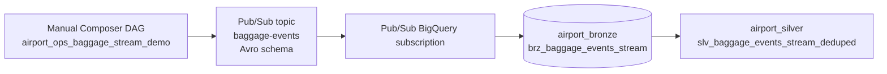

# Streaming ingestion

This optional demo turns baggage scans into low-rate live events while keeping the
main batch lakehouse DAG unchanged.



## Scope

- The simulator publishes 5 events per second by default, capped at 10.
- The run duration defaults to 600 seconds and is capped at 900 seconds.
- Pub/Sub writes directly to the bronze streaming table through a BigQuery
  subscription.
- Dataform declares that bronze table and builds a silver dedupe view.
- Batch Parquet baggage and streaming baggage both use the shared
  `airport_ops_demo.baggage_model` journey logic.
- The existing batch baggage fact remains unchanged.

## Resources

`scripts/bootstrap.sh` creates:

- Pub/Sub schema: `baggage-scan-event`.
- Pub/Sub topic: `baggage-events`, associated with the schema using JSON encoding.
- Dead-letter topic: `baggage-events-dlq`.
- Pub/Sub BigQuery subscription: `baggage-events-bq-sub`.
- Bronze streaming table: `airport_bronze.brz_baggage_events_stream`.

The bronze streaming table is partitioned hourly by `publish_time`, clustered by
`bag_id`, `flight_id`, and `terminal_id`, and expires partitions after 3 days.
It does not require a partition filter so live demo queries stay simple.

```sql
CREATE TABLE IF NOT EXISTS `PROJECT.airport_bronze.brz_baggage_events_stream` (
  event_id STRING NOT NULL,
  bag_id STRING NOT NULL,
  flight_id STRING,
  scan_type STRING,
  scan_ts TIMESTAMP,
  terminal_id STRING,
  belt_id STRING,
  status STRING,
  simulator_run_id STRING,
  subscription_name STRING,
  message_id STRING,
  publish_time TIMESTAMP,
  attributes JSON
)
PARTITION BY TIMESTAMP_TRUNC(publish_time, HOUR)
CLUSTER BY bag_id, flight_id, terminal_id
OPTIONS (partition_expiration_days = 3);
```

## Why Pub/Sub does not own table evolution

Pub/Sub schemas validate producer messages. BigQuery tables remain the governed
storage contract. A Pub/Sub BigQuery subscription maps valid topic messages into
an existing BigQuery table and writes through the Storage Write API.

When the Pub/Sub schema changes, BigQuery table compatibility must be handled
separately:

- Add nullable BigQuery columns before publishing messages with new optional
  fields.
- Keep field names and types compatible between the topic schema and table.
- Enable drop-unknown-fields only when extra fields should be intentionally
  discarded.
- Use the dead-letter topic to inspect messages that fail schema or sink writes.

Official references:

- [Pub/Sub schemas](https://docs.cloud.google.com/pubsub/docs/schemas)
- [Create a BigQuery subscription](https://docs.cloud.google.com/pubsub/docs/create-bigquery-subscription)
- [BigQuery subscription overview](https://docs.cloud.google.com/pubsub/docs/bigquery)
- [Stream into partitioned tables](https://docs.cloud.google.com/bigquery/docs/write-api#stream_into_partitioned_tables)

## Run the stream

Trigger the Composer DAG manually:

```bash
gcloud composer environments run "$COMPOSER_ENV" \
  --location="$REGION" dags trigger -- \
  -r "baggage-stream-$(date +%Y%m%d%H%M%S)" \
  airport_ops_baggage_stream_demo
```

Optional DAG run config:

```json
{
  "events_per_second": 5,
  "duration_seconds": 600,
  "seed": 42
}
```

For a short smoke test, use:

```json
{
  "events_per_second": 5,
  "duration_seconds": 60
}
```

## Inspect the stream

Recent bronze rows:

```sql
SELECT
  publish_time,
  event_id,
  bag_id,
  flight_id,
  scan_type,
  scan_ts,
  JSON_VALUE(attributes, '$.schema_demo_version') AS schema_demo_version
FROM `johanesa-playground-326616.airport_bronze.brz_baggage_events_stream`
WHERE publish_time >= TIMESTAMP_SUB(CURRENT_TIMESTAMP(), INTERVAL 1 HOUR)
ORDER BY publish_time DESC
LIMIT 50;
```

Deduped silver rows:

```sql
SELECT
  publish_time,
  event_id,
  bag_id,
  flight_id,
  scan_type,
  scan_ts
FROM `johanesa-playground-326616.airport_silver.slv_baggage_events_stream_deduped`
ORDER BY publish_time DESC
LIMIT 50;
```

Pub/Sub BigQuery subscriptions are at-least-once. The simulator occasionally
publishes the same `event_id` twice so the silver view can demonstrate dedupe.

## Schema v2 example

Do not let schema revisions imply automatic table migration. Evolve both contracts
deliberately.

Example v2 field:

```json
{"name": "scanner_id", "type": ["null", "string"], "default": null}
```

Migration sequence:

```sql
ALTER TABLE `johanesa-playground-326616.airport_bronze.brz_baggage_events_stream`
ADD COLUMN scanner_id STRING;
```

Then commit a compatible Pub/Sub schema revision and deploy publishers that emit
`scanner_id`. Keep the field optional so older messages remain compatible.

Do not delete schema revisions that validated already-published messages. Pub/Sub
BigQuery subscriptions using topic schemas can fail to write older messages if the
revision that validated them is deleted.

## Replay and backfill

Use replay when the downstream sink or transformation needs reprocessing. Use
backfill when older business events need to be published again, possibly using a
newer schema.

Replay with the same schema:

- Publish events with the original `scan_ts`.
- Use a new `simulator_run_id` or `backfill_run_id` attribute for observability.
- Keep `event_id` stable if silver dedupe should collapse replayed records.
- Use a new `event_id` only when the replay represents a new logical event.

Backfill with a newer schema:

- Add nullable BigQuery columns first.
- Commit a compatible Pub/Sub schema revision.
- Publish historical events with the original `scan_ts` and current `publish_time`.
- Monitor by `publish_time` for backfill operations and by `scan_ts` for business
  event time.
- Check subscription backlog and the DLQ for contract mismatches.

Example backfill run config:

```json
{
  "events_per_second": 5,
  "duration_seconds": 120,
  "backfill_run_id": "backfill-20260617-v2",
  "seed": 20260617
}
```

## Future extensions

- Add a silver journey-state view over the deduped stream.
- Add a BigQuery continuous query over `APPENDS(TABLE ...)` for near-real-time SLA.
- Use Dataflow when exactly-once delivery or windowed transforms are required.
